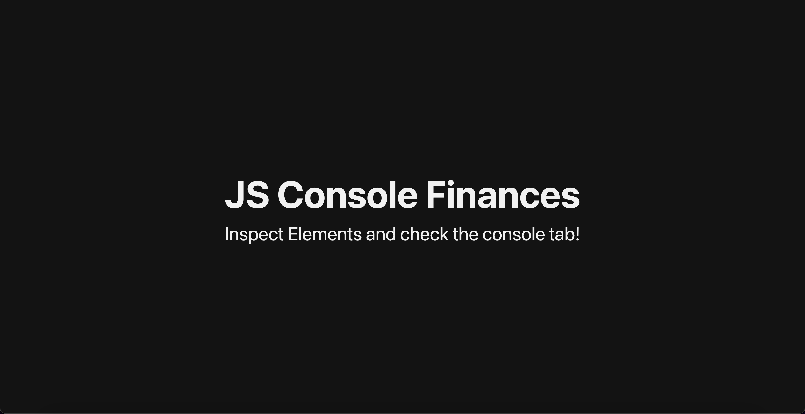
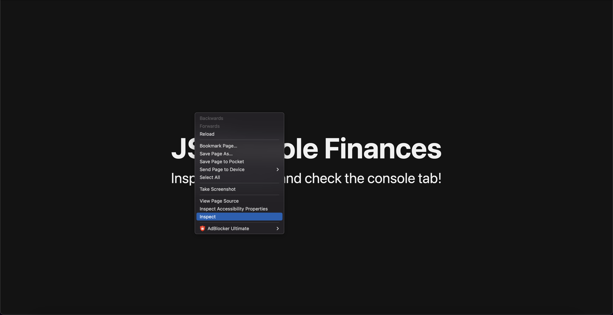
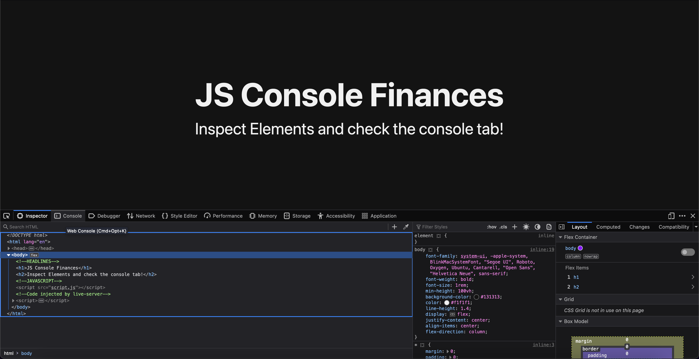
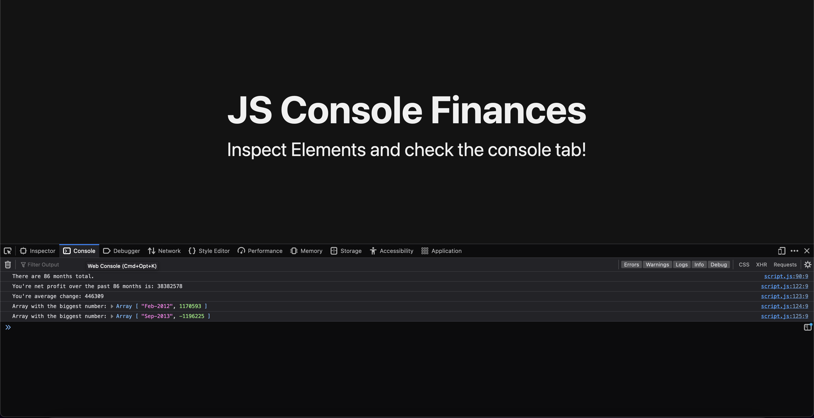

# JavaScript Console-Finances

## Description

This project was created to demonstrate my skills as a JavaScript beginner. This project takes data that has already been provided and sorts it into manageable information for the end user.

Along the way I learn't a lot of the basics within JavaScript and how to use things likes loops to iterate through data to target specific items and other pieces of data.

## Usage

Go to the landing page, right click and click on 'inspect elements'. Once the inspector pops up, click on the 'console' tab and once you're in there, you can see the console-finance project.

## License

MIT License

Copyright (c) [2023] [Curtis Bowen]

Permission is hereby granted, free of charge, to any person obtaining a copy
of this software and associated documentation files (the "Software"), to deal
in the Software without restriction, including without limitation the rights
to use, copy, modify, merge, publish, distribute, sublicense, and/or sell
copies of the Software, and to permit persons to whom the Software is
furnished to do so, subject to the following conditions:

The above copyright notice and this permission notice shall be included in all
copies or substantial portions of the Software.

THE SOFTWARE IS PROVIDED "AS IS", WITHOUT WARRANTY OF ANY KIND, EXPRESS OR
IMPLIED, INCLUDING BUT NOT LIMITED TO THE WARRANTIES OF MERCHANTABILITY,
FITNESS FOR A PARTICULAR PURPOSE AND NONINFRINGEMENT. IN NO EVENT SHALL THE
AUTHORS OR COPYRIGHT HOLDERS BE LIABLE FOR ANY CLAIM, DAMAGES OR OTHER
LIABILITY, WHETHER IN AN ACTION OF CONTRACT, TORT OR OTHERWISE, ARISING FROM,
OUT OF OR IN CONNECTION WITH THE SOFTWARE OR THE USE OR OTHER DEALINGS IN THE
SOFTWARE.
